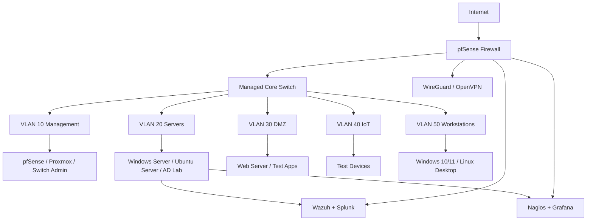

# Home Lab Topology

This Mermaid diagram documents the simulated home-lab network used for hands-on infrastructure and security practice.

```mermaid
flowchart TD
  Internet[Internet] --> Firewall[pfSense Firewall]
  Firewall --> Switch[Managed Core Switch]
  Firewall --> VPN[WireGuard / OpenVPN]
  Switch --> VLAN10[VLAN 10 Management]
  Switch --> VLAN20[VLAN 20 Servers]
  Switch --> VLAN30[VLAN 30 DMZ]
  Switch --> VLAN40[VLAN 40 IoT]
  Switch --> VLAN50[VLAN 50 Workstations]
  VLAN10 --> Mgmt[pfSense / Proxmox / Switch Admin]
  VLAN20 --> Servers[Windows Server / Ubuntu Server / AD Lab]
  VLAN30 --> DMZ[Web Server / Test Apps]
  VLAN40 --> IoT[Test Devices]
  VLAN50 --> Workstations[Windows 10/11 / Linux Desktop]
  Servers --> SIEM[Wazuh + Splunk]
  Servers --> Monitoring[Nagios + Grafana]
  Firewall --> SIEM
  Firewall --> Monitoring
```
