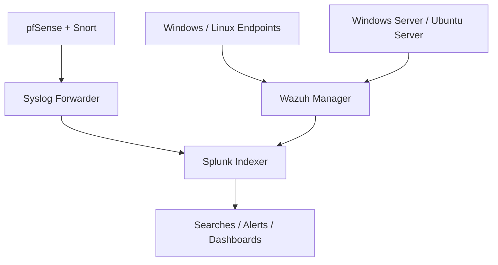

# SIEM Log Flow

This diagram shows how logs move from infrastructure systems into the monitoring stack.

```mermaid
flowchart TD
  Firewall[pfSense + Snort] --> Syslog[Syslog Forwarder]
  Endpoints[Windows / Linux Endpoints] --> Wazuh[Wazuh Manager]
  Servers[Windows Server / Ubuntu Server] --> Wazuh
  Syslog --> Splunk[Splunk Indexer]
  Wazuh --> Splunk
  Splunk --> Analyst[Searches / Alerts / Dashboards]
```
