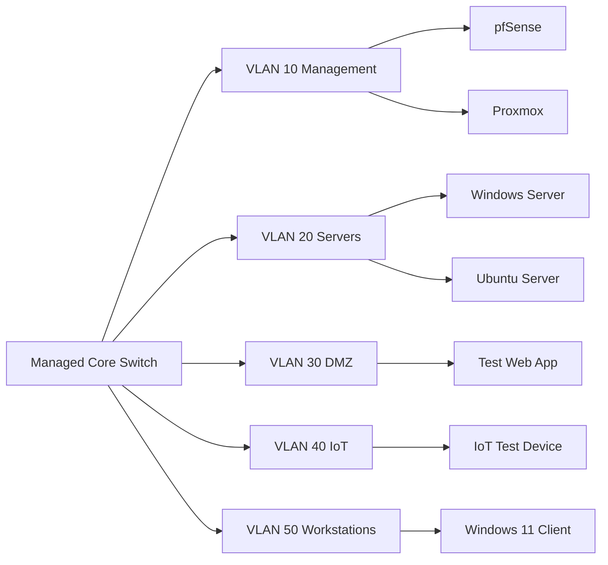

# VLAN Segmentation

The lab uses VLAN segmentation to practice routing, access control, and log visibility in a safe simulated environment.

```mermaid
flowchart LR
  Core[Managed Core Switch] --> V10[VLAN 10 Management]
  Core --> V20[VLAN 20 Servers]
  Core --> V30[VLAN 30 DMZ]
  Core --> V40[VLAN 40 IoT]
  Core --> V50[VLAN 50 Workstations]
  V10 --> M1[pfSense]
  V10 --> M2[Proxmox]
  V20 --> S1[Windows Server]
  V20 --> S2[Ubuntu Server]
  V30 --> D1[Test Web App]
  V40 --> I1[IoT Test Device]
  V50 --> W1[Windows 11 Client]
```
