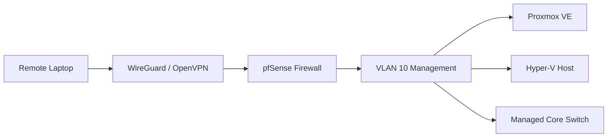

# VPN Access Flow

The lab uses VPN access to practice secure remote administration before management workflows are allowed.

```mermaid
flowchart LR
  Laptop[Remote Laptop] --> VPN[WireGuard / OpenVPN]
  VPN --> Firewall[pfSense Firewall]
  Firewall --> Mgmt[VLAN 10 Management]
  Mgmt --> Proxmox[Proxmox VE]
  Mgmt --> HyperV[Hyper-V Host]
  Mgmt --> Switch[Managed Core Switch]
```
