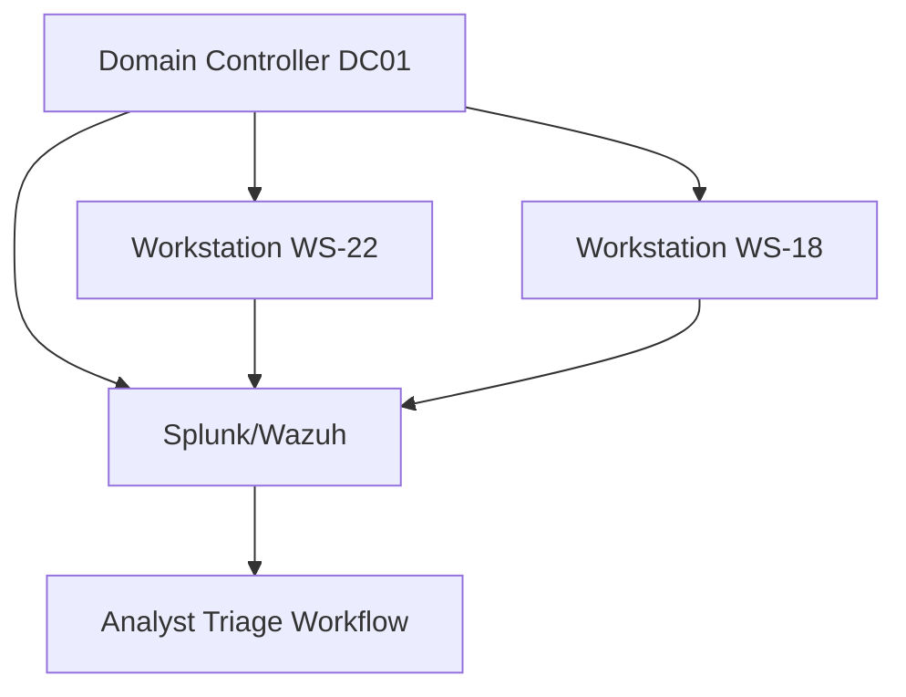

# Active Directory Lab Topology

```mermaid
flowchart TD
  DC[Domain Controller DC01] --> WS1[Workstation WS-22]
  DC --> WS2[Workstation WS-18]
  DC --> SIEM[Splunk/Wazuh]
  WS1 --> SIEM
  WS2 --> SIEM
  SIEM --> Analyst[Analyst Triage Workflow]
```
