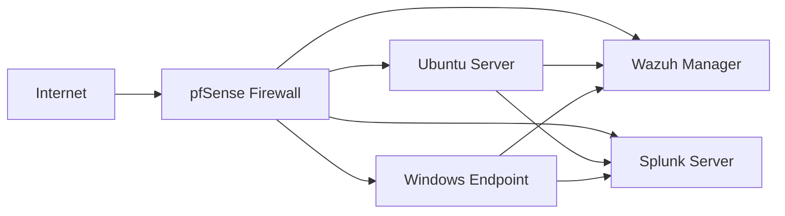

# SOC Lab Architecture

```mermaid
flowchart LR
  Internet --> FW[pfSense Firewall]
  FW --> WZ[Wazuh Manager]
  FW --> SPL[Splunk Server]
  FW --> UB[Ubuntu Server]
  FW --> WIN[Windows Endpoint]
  UB --> WZ
  WIN --> WZ
  UB --> SPL
  WIN --> SPL
```
