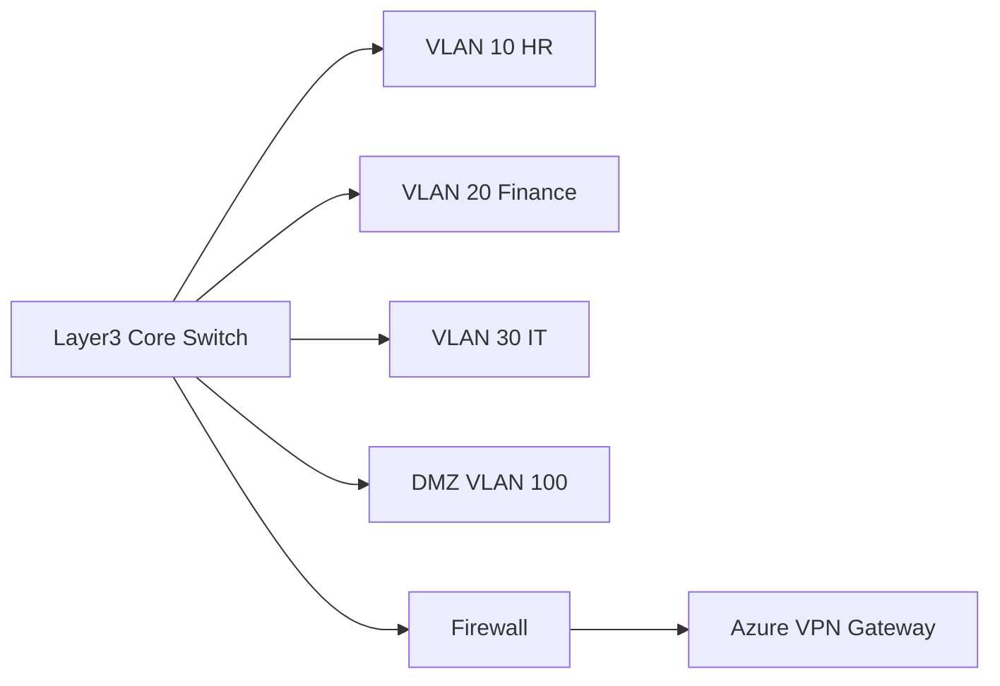

# VLAN Network Topology

```mermaid
flowchart LR
  CORE[Layer3 Core Switch] --> VLAN10[VLAN 10 HR]
  CORE --> VLAN20[VLAN 20 Finance]
  CORE --> VLAN30[VLAN 30 IT]
  CORE --> DMZ[DMZ VLAN 100]
  CORE --> FW[Firewall]
  FW --> VPN[Azure VPN Gateway]
```
